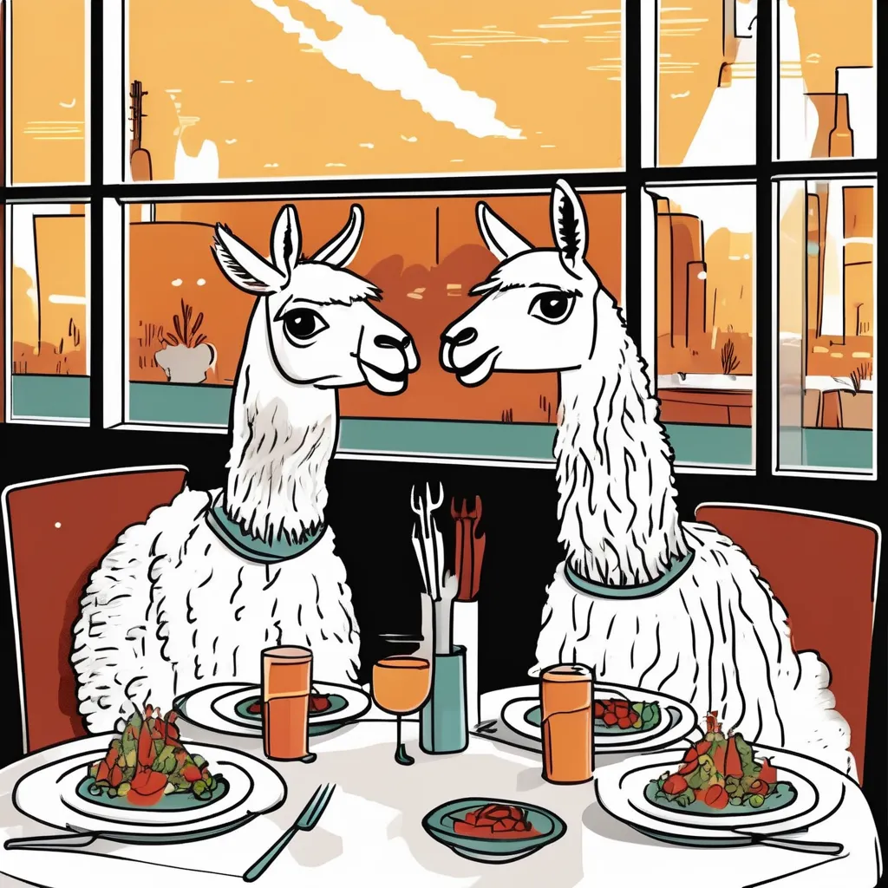

# The Dining Llamas of Oz Corpus

Welcome to **The Dining Llamas of Oz** repository! This corpus is a collection of 1,311 task-oriented dialogues generated using the Llama-3 language model, specifically focused on restaurant booking scenarios. The dataset is designed to facilitate research in dialogue systems, particularly in maintaining consistency with a provided knowledge base (KB) and minimizing hallucinations.

## Table of Contents

- [Introduction](#introduction)
- [Dataset Structure](#dataset-structure)
- [Usage](#usage)
- [Contact](#contact)

## Introduction

The Dining Llamas of Oz corpus was created to investigate the capabilities of state-of-the-art language models in generating task-oriented dialogues. Our findings indicate that while models like Llama-3 can generate coherent dialogues, they struggle to maintain consistency with a provided KB and often hallucinate, especially in longer interactions or when the desired restaurant is not in the KB.

## Dataset Structure

The dataset is divided into three sets:
- **Training Set**: 1,049 dialogues
- **Validation Set**: 131 dialogues
- **Test Set**: 131 dialogues

Each dialogue consists of interactions between a user Llama and a system Llama, grounded in a randomly selected subset of the KB.

## Usage

To use the dataset, clone this repository:

```bash
git clone https://github.com/yourusername/The-Dining-Llamas-of-Oz.git
```

You can find the dialogues in the `data/` directory, organized in JSON format. Each dialogue file contains:
- **user**: The user's utterances.
- **system**: The system's responses.
- **kb**: The knowledge base subset used for the dialogue.

## Contact

For any questions or feedback, please contact us at tlabruna@fbk.eu.

Enjoy working with The Dining Llamas of Oz corpus!
